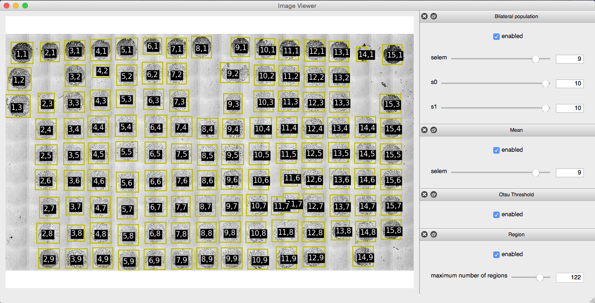

# Abstract

What to communicate: goal, overview of experiences made, results

This thesis documents work on automatic microscope imaging of breast tumor tissue micro arrays and how the images can be analyzed for a supplement in cancer diagnosis. The overall research goal has been to classify tumor grade (I, II or III) based on the fiber structure in the tissue samples. Supervised machine learning is the method of analysis, where St. Olavs hospital has supplied a dataset of tissue samples at the tumor peripheral from 924 (TODO update excact number) patients.

Automated microscope scanning is in principle straight forward, but the implementation will be dependent on many aspects of the experimental setup. In general, some of the aspects discussed in this thesis are:

- correcting for systematic errors like intensity variations
- create image analysis algorithms that are robust to experimental variations
- verify that metrics reported by the system are the real physical ones
- finding good compromises between time, signal quality and ease of measurement
- scanning mirror- versus stage coordinate system and reliable stitching
- writing cross-platform software

The general aspects listed above are not unique to the experiments and experimental setup, and could potentially be useful for others. But this thesis will also address issues directly associated to tissue micro arrays and the Leica SP8 microscope:

- adjusting z-plane for large area samples with micrometer precision
- working around Leica software limitations

Results on the dataset was positive/negative. Details on the result.

A proposal for further research with the same dataset is extracting more features from the images and use equivalent methods to find relationships to the clinic data. IF POSITIVE RESULT: Collecting tissue sample is a part of the standard procedure in breast cancer diagnosis at St. Olavs hospital, and one can do the analysis described in this thesis to further confirm or falsify the result.


# Introduction

What to communicate: motivation, brief summary of chapters

With a population just above 5 million [1], three thousand women are diagnosed with breast cancer each year [2] in Norway. This makes breast cancer the most common kind of cancer, affecting one of every eleventh woman. Luckily the cancer form is often treatable, and in 2012 there was 649 fatalities caused by breast cancer [3]. The diagnosis is an act of several steps, and currently contains the following at St. Olavs hospital:

- x-ray mammography
- ultra sound screening
- tissue sample(s)

In particular, pathologists suggest that aggressiveness of a tumor is related to how fiber is aligned at the tumor peripheral. In example straight aligned fibers can be a sign that tumor cells have modified the stroma to promote spreading of cells. The alignment of fibers is a feature which can be extracted by image processing. Since several techniques to extract features is imaginable, supervised machine learning is practical for finding novel approaches.

[1]: https://www.ssb.no/befolkning/statistikker/folkemengde
[2]: http://www.stolav.no/Pasient/Pasientforlop/Pasientforlop/Kreftsykdommer/Behandling-av-brystkreft/130731/
[3]: https://www.ssb.no/dodsarsak

From report - may use some of this:
Over three million published articles on pubmed with keyword cancer shows
the huge research effort for understanding, diagnosing and treating cancer
diseases. The research focus is mainly on tumor cells, but a segment of
interest which is increasing is research on tumor stroma as seen in figure
1.1.

Figure 1.1: Amount of published articles by year on different search terms. The search term tumor cells outnumber the others by two orders of magnitude. Note the logarithmic scale on y-axis.

Tumor stroma is the environment of cells, and it can be suppressing
or supporting the function of the tumor cells. It is suggested that in
the development of a tumor, the stroma is changing from being suppressive to
supportive of the tumor cells [TODO REF].

In particular, collagen fiber is known to be altered in the surroundings of
tumor cells under the development towards metastasis. One bio-marker for
collagen fibers, is their alignment at the vincinity of the tumor, which may
predict if a tumor is malignant. The fiber alignment can be used as a
diagnosis tool for malignant tumor, and an article written at NTNU have
studied collagen fiber alignment in a manual qualitative manner.

St. Olav hospital have breast tissue samples from 900 pasients along with
clinical data. In total three samples per pasient, one sample inside, one sample at the boundary and one sample outside the tumor. The samples is laid in a matrix on a glass slide, each glass slide having about 130 samples. As microscope scanning and analysis of such a large data set is not straightforward, this project have explored possibilities for automating the process.

To be specific, this thesis will describe method and results for
- parameters for obtaining quality SHG images
- effective way to scan whole glass slides of 126 samples
- machine learning and correlation to clinical data

> ML: En hoveddel i arbeidet har vært automatiseringen av TMA. Skrive noe om TMA og hvorfor automatisert analyse er nødvendig...skal lede opp til en beskrivelse av de tekniske utfordringene som er løst.


# Theory

What to communicate: theory and details that are not obvious for understanding the rest of the text

> ML: I denne delen bør man primært ha med teori som er nødvendig for å forstå det som kommer i metodedelen. Altså ikke skriv for mye her før strukturen og innholdet er mer klart.)

## Image Processing
- scikit-image, utils.ipynb, defaults in code blocks


ORB and Ransac [1]
[1]: https://peerj.com/articles/453/#p-1
## Scanning microscope
- Epi setup
- scanning, descanned detectors

focal volume
## Nonlinear light interaction


# Method

What to communicate: experimental setup to reproduce results, description of automatic process, limitations/obstacles specific to experimental setup, brief description of software modules in use

## Microscope
The images has been taken with a Leica SP8 microscope using LAS X software version 1.1.0.12420 from Leica Microsystems CMS GmbH. Two lasers was in use, a pulsing Coherent laser and a continious LASOS argon laser. Full specifications of lasers are in table \ref{tbl:lasers}.

+----------+--------------------+--------------------------------------------+
| Brand    | Model              | Specifications                             |
+==========+====================+============================================+
| Coherent | Chameleon Vision-S | Modelocked Ti:Sapphire,                    |
|          |                    | wavelengths 690-1050 nm,                   |
|          |                    | 2500 mW,                                   |
|          |                    | 80 MHz pulsing,                            |
|          |                    | $\approx$ 75 ps pulse width                |
+----------+--------------------+--------------------------------------------+
| LASOS    | LGK 7872 ML05      | Argon Continious wave,                     |
|          |                    | wavelengths 458, 476, 488, 496 and 514 nm, |
|          |                    | 65mW                                       |
+----------+--------------------+--------------------------------------------+

: Lasers {#tbl:lasers}

The SP8 microscope has an inverted epi-setup, with four descanned detectors and four non descanned detectors. The descanned detectors use a prism along with adjustable mirrors so that specific wavelengths can be picked out in the signal, ranging from TODO. The descanned detectors was used with band pass filters of 525/50 nm and 445/20 nm. Two of the descanned detectors are behind the objective and two on opposite side of the objective behind a collector, which makes it possible to measure both backward and forward light.


## Automated scanning

Communicate: the procedure of automatic scanning

The automated scanning aims to lift the burden of manually labor and prevent errors in the imaging process by finding regions with the samples in an overview image. The process consists roughly of the steps:

- Take an overview image with low magnification
- Segment the overview image
- Allow user to confirm or adjust the segmentation
- Scan each region

Overview images was taken with a 10x air objective, equalized and stitched. The equalization step corrects uneven illumination and increases contrast for viewing purposes. To improve robustness of segmentation, a local bilateral population filter was applied to the stitched image before it is thresholded. Each separate region in the segmentation are sorted by their area size, small regions are excluded and the user can exclude or add regions if some of the samples are not detected. Row and column position of the regions are calculated by sorting them by their position in the image. A more detailed description follows.

### Overview images
Overview images was taken with an technique similar to bright-field microscopy except that the light source is a scanning laser. The laser in use was the argon laser in table \ref{tbl:lasers} with 514 nm emission line, output power set to 2.48% and intensity to 0.10. Forward light was imaged using a 0.55 NA air collector with the non descanned detector having the 525/50 nm bandpass filter. Aperture and detector gain was adjusted so that the histogram of intensities was in the center of the total range without getting peaks at minimum and maximum values.

Zoom 0.75 and 512x512 pixels was chosen, which gives images of $\approx$ 1500 $\mu$m (read more about resolution and image size in the discussion).

#### Uneven illumination
 {#fig:illumination}

The uneven illumination in the experimental setup is illustrated in figure \ref{fig:illumination}(a). By assuming the intensity variation in all pixels are following the slope of the background, equalization was done by dividing each row in the image by the normalized intensity profile of the background.

``` {caption="Equalizing an image" label=code:equalize .python}
equalized = img.astype(np.float)        # assure datatype have real division ability
equalized -= images_minimum             # normalize
equalized /= images_maximum - images_minimum
equalized /= intensity_profile          # equalize
equalized[equalized > 1] = 1            # clip values
```

As seen in code listing \ref{code:equalize} the image is first normalized. `images_minimum` and `images_maximum` is found by selecting the median of respectively minimum and maximum intensity of all images. By taking the median of all images one avoids outliers and gets the same normalization for all images. Similar technique could be used for normalizing the images after equalization, but clipping gave acceptable results. `intensity_profile` is a curve fit for one of the background rows. The background row was found by selecting the row with least variance (given that the image does have a row with background only). In figure \ref{fig:illumination}(b) the row with least variance is indicated with a white line. The same intensity profile is used on all images, and it's fitted to a second degree polynomial to steer clear from noise as illustrated in \ref{fig:illumination_intensities}(a).

The effect on pixel values can be seen in figure \ref{fig:illumination}_intensities (b) and (c), where each dot represents a pixel value with increasing image x-position on the x-axis.

 {#fig:illumination_intensities}

#### Stitching
 {#fig:stitching}

Due to little signal in areas between samples, automatic stitching with correlation methods are prone to fail. To remedy this, the same overlap was chosen when stitching the overview image. Using the same overlap in this context gives reliable stitching with negligible errors. The overlap is chosen by calculating all overlaps with phase correlation and taking the median. The stitching was put in a python package and can be used as shown in code listing \ref{code:stitch}.

``` {caption="Stitching images with the python package *microscopestitching*." label=code:stitch .python}
from microscopestitching import stitch
from glob import glob

files = glob('path/to/images/*')
images = []
for i, file in enumerate(files):
    # rectangle of 4 rows and len(files)//4 columns
    row = i % 4
    column = i // 4
    images.append((file, row, column))

stitched_image = stitch(images)
```

#### Segmentation
 {#fig:segmentation}

As seen in figure \ref{fig:stitching}(b), the samples at the edge are darker than the samples in the center. To improve this intensity variation, the overview image is filtered with a local bilateral population filter. The filter counts number of neighbour pixels that are within a specified range. The effect of the filter is somewhat similar to an entropy filter (though converse), and less computational demanding. Areas with low signal variation (the background) gives high values and areas with high signal variation gives low values (the samples). To reduce noise after the bilateral population filter, a mean filter was applied. The size of structure elements was 9x9 pixels for both filters. Figure \ref{fig:segmentation}(a), (b) and (c) show how the segmentation is affected by the filters. Code for reproducing the steps are in code listing \ref{code:segmentation}.

``` {caption="Filter and segment an image with local bilateral population and Otsu thresholding." label=code:segmentation .python}
from skimage.morphology import square
from skimage.filters import threshold_otsu
from skimage.filters.rank import mean, pop_bilateral

selem = square(9)
filtered = pop_bilateral(image, selem)
filtered = mean(filtered, selem)

threshold = threshold_otsu(filtered)
segmented = filtered < threshold # low values indicate signal
```

After segmentation, regions are sorted by their area size and only the largest regions are kept. Row and column was calculated by sorting regions by position, measuring the distance between them and increment row or column number when there is a peak in the distance to previous region. The code can be seen in code listing \ref{code:regions} and figure \ref{fig:regions} illustrate typical area size, position and position derivative.

 {#fig:regions}


``` {caption="" label=code:regions .python}
from skimage.measure import label, regionprops

labels = label(segmented, background=0) # background=0: exclude background
regions = regionprops(labels)           # measure region properties
regions.sort(key=lambda r: -r.area)     # sort by area size, largest first

max_regions = 126
if len(regions) > max_regions:
    regions = regions[:max_regions]     # only keep max_regions

for r in regions:
    r.y, r.x, r.y_end, r.x_end = r.bbox # for convenience

for direction in 'yx':                  # same algorithm for row and columns
    regions.sort(key=lambda r: getattr(r, direction))

    previous = regions[0]
    for region in regions:              # calc distance to previous region
        dx = getattr(region, direction) - getattr(previous, direction)
        setattr(region, 'd' + direction, dx)
        previous = region
```

The whole process of segmentation is interactive as part of the python package *leicaautomator*, where settings can be adjusted to improve segmentation and regions can be adjusted by moving, deleting or adding. The interface is shown in figure \ref{fig:leicaautomator}.



#### Taking SHG and DAPI images
settings, laser, objective, collector, aperture


## Collection of SHG images
- alignment of z-plane
- finding tissues in micro array
- correlation with patient data (sample map and clinic data)

## Technical details
### Hardware aspects
- z-plane off by several hundreds of micrometer
  - piezo-holder tilted
  - slides not necessarily straight, coverslip placement
  - too much tilt: out of focus in one image
  - tolerated tilt and software autofocus: stitching when edge not from same physical area (especially thick samples)
- signal variations and chosen optimum
  - collector 0.55 vs 0.9 when overview vs SHG
  - aperture not adjustable from software, resets when using occular
  - hard to get same conditions every time (might move to discussion: suggest using test sample routine along with image analysis)
- rotation scanning mirror
  - stitch
  - finding angle with image registration / phase correlation
- edge of image, intensity variation
  - zoom
  - correction for overview vs SHG
- HyD shutdown too much light
  - HyD behind mirror might get less light, but still good signal
  - pinhole adjustment for HyD behind mirror to avoid bright spots?
- reported resolution from LAS not same as stage movement
  - use image registration to calculate px-resolution
  - calibration of measurement-equiptment
  - what measurement to trust
- outage and service
  - logging, feedback and communication between researchers
  - service contracts


### Leica software details
The microscope software in use was Leica LAS X version TODO.

- loading template with variable positioned wells not working
  - offset first well will offset all wells
  - Properties/XStartPosition not used
  - no "template-type" property
  - must be loaded in GUI first time
    - through CAM opens GUI dialog "Import?"
- CAM only available after manually loading a template in GUI
  - GUI automation
- loading modified template with same name
- loading templates automatic goes to position and changes objective
  - crashes possible
  - trouble if using imersion objective
- switching between AF / job in GUI will automatically switch objective without warning
  - trouble if using imersion objective
- mix of 0-indexed and 1-index variables
  - files 0 indexed
  - cam 1 indexed
  - xml 1 indexed (TODO: verify)
- GUI hangs if socket is not read
- loading template should omit .xml from filename
  - saving template should not
  - not noted in documentation
  - "templ.xml.xml not found"
- save template does not update with latest changes in GUI
- XML does not read when missing return char "\r"
  - not in XML specification
- z-position in template not read
- z-position from CAM sometimes gives "0" instead of real position
- adjusting x/y-coordinate on USB-control panel moves stage to zero or max position

### Software development
- Separate of concerns
  - modules and code reuse
  - publication of software packages and python ecosystem
- leicacam: talking with microscope
- leicascanningtemplate: modify templates
- leicaexperiment: read, stitch, ome.tif experiments
- microscopestitching: reliable stitching with phase corralation (remove outliers vs median)
- leicaautomator: find regions to scan, unifies all of the above
- python cross platform and compilation
  - heavy c/c++ dependency
  - miniconda
  - wheel packages

Utilities (not specific thesis):
- fijibin: automate fiji/imagej from python
- ipynbcompress: compress images in ipython notebooks


> ML: Kan også skrive om spesifikke aspekter ved mikroskopsystemet som har muliggjort/begrenset/forhindret løsningene. All programvare som er utviklet bør omtales her, eventuelt med mer detaljer i et appendiks)


# Result
What to communicate: achievements and show-stopper/hard limitations

## Segmentation


> ML: Resultat så langt: Kontroll via Python, segmentering, z-correction


# Discussion
What to communicate: discuss results, limitations, possibilities for improvement

> ML: Hvilke valg har blitt tatt, hva er viktig for neste bruker, hva er begrensninger, utviklingsmuligheter, pros/cons, hvor bra fungerer det....)


# Conclusion
What to communicate: brief summary of the result and discussion, advice for further work

> ML: Automatic imaging and segmentation of TMA has been demonstrated)...and....


# Appendix
Leica LAS design:
- user should be mainly in LAS - automating on the side as a supplement
  - load before CAM can be used
  - does not load all settings from XML
