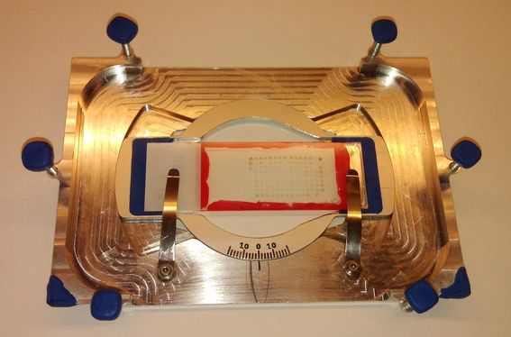

# Preface {.unnumbered}
Five years at NTNU have been a rollercoaster ride. Uphills at times, but also a great deal of fun. I'm grateful for the number of marvellous people I have met, the flexibility the student life brings, all the fun with the student society Spanskrøret and not to forget all the things I've learned.

A special thank you go to all the professors who withstand sharing their knownledge every day, even at time when their students seems unmotivated.

The last year I have been warmly included in Magnus Borstad Lilledahl's research group, with Andreas Finnøy, Elisabeth Inge Romijn and Rajesh Kumar. It's been educational to work with them and exciting to get an insight in how they perform their research. Thank you!

I would also like to thank my family, who always have been supportive for the choices I've made.

Lastly, the greatest thanks go to my life companion Yngvild, it wouldn't have been the same without you.

And the cheesy quote is..
> The future is already here, it's just not very evenly distributed. - William Gibson


\tableofcontents


# Abstract {.unnumbered}
What to communicate: goal, overview of experiences made, results

St. Olavs hospital has supplied a dataset of 2703 tissue samples at the tumor peripheral from $\approx$ 900 patients. NTNU want to examine all tissue samples with image processing to see if second harmonic generation microscope images of tissue can help classify cancer type (I, II, III) or in other words, cancer aggresiveness. This thesis documents a method which automates the microscope imaging of these tissue micro arrays (TMA) and show how images can be structured and correlated to clinical data.

Automated microscope scanning is in principle straight forward, but the implementation is dependent on many aspects of the experimental setup. In general, some of the aspects discussed in this thesis are:

- Create image analysis algorithms that are robust to experimental variations.
- Correction of systematic errors like
  - intensity variations and
  - difference in coordinate systems of scanning raster patterns and stage movement.
- Automatic stitching of regular spaced images with variable degree of signal entropy in seams.
- Adjusting z-plane for large area samples with micrometer precision.

The aspects listed above are not unique to TMA-specimens and the experimental setup, and could be useful for similar projects. But the focus of the thesis will be on TMA and the experimental setup with a Leica SP8 microscope.

The conclusions are:

- Large area scans should adjust speciment plane to be at even distance to the objective to be time effective and avoid out of focus images.
- Using heuristics/constraints improves the reliability to automatic stitching algorithms, failing gracefully on images with little entropy in overlap.
- Leica LAS X version 1.1.0.12420 have limited support for automatic microscopy, but it exist workarounds for fully automatic TMA-scanning.


# Introduction

What to communicate: motivation, brief summary of chapters

With a population just above 5 million [@statistisk_sentralbyra_folkemengde_2015], three thousand women are diagnosed with breast cancer each year [@statistisk_sentralbyra_dodsarsaker_2013] in Norway. This makes breast cancer the most common kind of cancer, affecting one of every eleventh woman. Luckily breast cancer is often treatable, shown by the fatalities which was 649 in 2012 [-@statistisk_sentralbyra_dodsarsaker_2013]. NTNU and St. Olavs hospital have been cooperating on reasearch to find new ways to diagnose patients. The cooperation yielded a study [@brabrand_alterations_2015] on 37 subjects which showed positive results on difference of collagen structure from different parts of tumor tissue. This thesis seeks to make it possible to expand the study from 37 subjects to the whole dataset available of $\approx$ 900 subjects.

The means to achieve the expanded dataset is automating the microscope imaging, with main focus on automated scanning of tissue micro arrays. Tissue micro arrays are glass slides with samples arranged in a matrix pattern seen in [@fig:tma]. As tissue micro arrays is standard procedure, not unique to breast cancer tissue, the work of this master is relevant for other studies too.


 {#fig:tma}


The tissue micro array shown in [@fig:tma] is $\approx$ 24x15 mm in size. Using a moderate objective of 25x with 400 \si{\micro\metre} field of view, a single scan of the total dataset will be

$$ \frac{24 \si{\milli\metre}}{400 \si{\micro\metre}} \cdot \frac{15 \si{\milli\metre}}{400 \si{\micro\metre}} = 2250 \text{ images.} $$

Depending on the precission of the microscope stage, images are not necessarry easily put together. Also, keeping microscope in focus for the whole surface can become challenging. Another approach would be not to scan the whole area in one scan, but to scan each of the $14 \cdot 9 = 126$ tissue specimens one by one. The challenge with scanning each region one by one is that the samples are often not equally spaced, and a lot of manual error prone labor is required to define the areas to scan. The method in this thesis tries to simplify the scanning process and prepare the images for further analysis.

The thesis are written with focus on two parts, namely automating the collection of images and correlating samples to clinical data. How this can be used in supervised machine learning will be briefly mentioned in the end. In total the method described should enable researchers to run experiments on large datasets of tissue micro arrays in a structured and determined manner.

A reader of this text should be familiar with general physics. Matters that are specific to scanning microscopy and image processing will be described in the theory section, along with software concepts in use. The method section seeks to make the reader able to replicate the experiment on any kind of microscope, but some software and solutions will be specific to the Leica SP8 microscope. The result section will mark out leverages gained with automated scanning, and the discussion holds details on choices made when developing the method and limitations stumbled upon.

All source code in the thesis will be in the programming language python [@python_software_foundation_official_2015]. The reader should not need to be proficient in python programming, but acquaintance with the syntax is assumed. Code listings will be used to clarify how problems have been solved or algorithms have been implemented. Details not essential to the problem at hand have been omitted, but all source code can be read at github [@seljebu_arve0_2015].

> ML: En hoveddel i arbeidet har vært automatiseringen av TMA. Skrive noe om TMA og hvorfor automatisert analyse er nødvendig...skal lede opp til en beskrivelse av de tekniske utfordringene som er løst.


# Theory

What to communicate: theory and details that are not obvious for understanding the rest of the text

> ML: I denne delen bør man primært ha med teori som er nødvendig for å forstå det som kommer i metodedelen. Altså ikke skriv for mye her før strukturen og innholdet er mer klart.)


## Image Processing
The term image in this contex a two dimentional array of values, where each position in the array is called a pixel. Resolution is the number of pixels an image holds. E.g. a resolution of 1024x1024 is an image with 1024 pixels in both x- and y-direction, totalling \num{1e6} pixels. Each pixel represent a physical position of the specimen, where the value is the amount of light measured from the detector when scanning the specimen surface with a light source. The physical size of the pixel will depend on sampling rate. All images in this thesis are 8 bit grayscale images, meaning that each pixel can hold $2^8=256$ values. In an ideal experiment a pixel value of zero denote zero detected light and 255 is the maximum, but this is an simplification as noise will be measured too.

$f(x, y)$ denotes the intesity of pixel at position $(x, y)$, where $(0, 0)$ is the top left of the image. Positive x-direction is to the left, positive y-direction is downwards. In 


- scikit-image, utils.ipynb, defaults in code blocks


### OCR
Optical character recognition (OCR) is in this context recognition of characters in a digital image. OCR internals are not discussed, but it basically works by looking at patterns in the image to convert the image to text.

## Scanning microscope
Figure \ref{fig:epi} illustrate the internal workings of a Leica SP8 scanning microscope which have an epi-illumination setup. Epi-illumination is when the detectors (26) and light source (1, 3, 5, 7) are on the same side of the objective (18). But as seen, the epi-setup also allows for external detectors (19). By scanning one means that the light source is focused to a specific part of the specimen and scanned line by line in a raster pattern. While the laser are scanned over the surface, a detector measure light in samples and each measured sample of light will be saved to an image pixel. The scanning is done by a oscillation mirror (14). The term non descanned detector indicate that the light does not travel by the scanning mirror before the detector. In SP8 (17) and (19) are non descanned detectors, where (17) measure reflected light and (19) measure transmitted light.

![Internals of a Leica SP8 microscope. Picture from Leica SP8 brochure [@leica_microsystems_cms_gmbh_leica_2014].](figures/epi.jpg) {#fig:epi}

The view field of a microscope is the physical size of viewable area. The view field depends on the magnification of the objective and the scanner zoom. Scanner zoom is when the scanner is set to oscillate with less amplitude while still sampling at the same rate. As field of view is at the magnitude of \num{1e-4} \si{\metre}, specimen must be moved around to image a larger area. The device that moves the specimen is called a stage. The stage position, or specimen position if you like, is denoted with a upper case $X$ to distinguish it from lower case $x$ which denote image pixel position.

## Software

### Leica LAS X
The Leica software comes with an function called *Matrix Screener*, which allows the user to define structured areas to scan. The software uses the concepts fields and wells. A field is essentially an image, and a well is a collection of regular spaced images. The wells may be regular spaced, or an offset between wells can be defined in the graphical user interface. The scan job is started, Leica LAS will store images in a tree of folders in TIFF format.


### CAM
In addition to controlling the microscope with the graphical user interface, a function called *Computer Assisted Microscopy* (CAM) can be turned on. CAM is a socket interface, meaning one send bytes over a network interface. This is very similar to how one can write bytes to a file, but in addition the socket interface can respond and send bytes back. The network interface runs on TCP port 8895 and one may be communicate locally or over TCP/IP network. A set of 44 commands are available, but only three of them are intresting for the purpose of controlling scans; `load`, `autofocusscan` and `startscan`. More details on the interface can be read in the manual [@frank_sieckmann_cam_2013] or by studying the source code of the package `leicacam` [@arve_seljebu_arve0/leicacam_2015]. Code listing \ref{code:leicacam} show how one can communicate with the microscope in python.


``` {caption="" label=code:leicacam .python}
from leicacam import CAM

# connect to localhost:8895
cam = CAM()

# load a template named leicaautomator
cam.load_template('leicaautomator')

# start the autofocus scan defined in 'leicaautomator' template
cam.autofocus_scan()

# start the scan job
cam.start_scan()

# read filename in response from microscope when images are scanned
relpath = cam.wait_for('relpath')
```

### XML
Extensible Markup Language is a declarative language which most high level programming languages speak, which makes it adapted for communicating between computer programs. A XML-file contain a single root and tree structure with parent and children nodes. Any position in the tree can be specified with an *XPath*. Code listing \ref{code:xml} show a typical structure of a XML-file.


``` {caption="XML-tree structure with " label=code:xml .xml}
<?xml version="1.0"?>
<root>
    <parent>
        <child attr="val1">text</child>
        <child attr="val2">text2</child>
    </parent>
    <parent>
        <child attr="val3">text</child>
        <child attr="val4">text2</child>
    </parent>
</root>
```

The XML-file might be nested with several childen and parents, but code listing \ref{code:xml} holds for illustration purposes. XPath for the first child in parent will be `./parent/child[@attribute="val1"]`. Here `.` is the root, `/` defines path (or nesting if you like) and `[@attribute="val"]` defines that the attribute named `attr` should be the value `val1`. This XPath will find only the first child of the first parent, but if other childs with same path also had an attribute named `attr` with the value `val1`, the XPath would have found them also. E.g. `./parent/child` will find all children. Code listing \ref{code:pythonxml} show how one would read properties from the XML-file in code listing \ref{code:xml}.

``` {caption="Accessing XML properties with python build-in module xml.etree." label=code:pythonxml .python}
import xml.etree.ElementTree as ET

tree = ET.parse('/path/to/file.xml')

first_child = tree.find('./parent/child')
first_child.attrib['attr'] == "val1" # True

all_children = tree.findall('./parent/child')
len(all_children) == 4 # True
```

### Scanning Template
A scanning template is a XML-file which defines which regions a scan job exists of. The structure of the file is the following:

- **./ScanningTemplate/Properties** holds experiment settings like start position, displacement between fields and wells, start position, which Z-drive to use, and so on.
- **./ScanFieldArray** holds all fields (images) and their settings as attributes in `./ScanFieldArray/ScanFieldData`.
- **./ScanWellArray** holds all wells (collection of images) and their settings as attributes in `./ScanWellArray/ScanWellData`.


## Nonlinear light interaction

- focal volume


# Method

What to communicate: experimental setup to reproduce results, description of process, brief software listings to show usage of software modules

## Microscope
The images has been taken with a Leica SP8 microscope using LAS X software version 1.1.0.12420 from Leica Microsystems CMS GmbH. Two lasers was in use, a pulsing Coherent laser and a continious LASOS argon laser. Full specifications of lasers are in [@tbl:lasers].

+----------+--------------------+--------------------------------------------+
| Brand    | Model              | Specifications                             |
+==========+====================+============================================+
| Coherent | Chameleon Vision-S | Modelocked Ti:Sapphire,                    |
|          |                    | wavelengths 690-1050 nm,                   |
|          |                    | 2500 mW,                                   |
|          |                    | 80 MHz pulsing,                            |
|          |                    | $\approx$ 75 ps pulse width                |
+----------+--------------------+--------------------------------------------+
| LASOS    | LGK 7872 ML05      | Argon Continious wave,                     |
|          |                    | wavelengths 458, 476, 488, 496 and 514 nm, |
|          |                    | 65mW                                       |
+----------+--------------------+--------------------------------------------+

: Lasers {#tbl:lasers}

The SP8 microscope has an inverted epi-setup, with four descanned detectors and four non descanned detectors. The descanned detectors use a prism along with adjustable mirrors so that specific wavelengths can be picked out in the signal, ranging from TODO. The descanned detectors was used with band pass filters of 525/50 nm and 445/20 nm. Two of the descanned detectors are behind the objective and two on opposite side of the objective behind a collector, which makes it possible to measure both backward and forward light.


## Automated scanning

Communicate: the procedure of automatic scanning

The automated scanning aims to lift the burden of manually labor and prevent errors in the imaging process by finding regions with the specimens in an overview image. The process consists roughly of the steps:

- Take an overview image with low magnification
- Segment the overview image
- Allow user to confirm or adjust the segmentation
- Scan each region

Overview images was taken with a 10x air objective, equalized and stitched. The equalization step corrects uneven illumination and increases contrast for viewing purposes. To improve robustness of segmentation, a local bilateral population filter was applied to the stitched image before it is thresholded. Each separate region in the segmentation are sorted by their area size, small regions are excluded and the user can exclude or add regions if some of the specimens are not detected. Row and column position of the regions are calculated by sorting them by their position in the image. A more detailed description follows.

### Overview images
Overview images was taken with an technique similar to bright-field microscopy except that the light source is a scanning laser. The laser in use was the argon laser in [@tbl:lasers] with 514 nm emission line, output power set to 2.48% and intensity to 0.10. Forward light was imaged using a 0.55 NA air collector with the non descanned detector having the 525/50 nm bandpass filter. Aperture and detector gain was adjusted so that the histogram of intensities was in the center of the total range without getting peaks at minimum and maximum values.

Zoom 0.75 and 512x512 pixels was chosen, which gives images of $\approx$ 1500 $\mu$m (read more about resolution and image size in the discussion). After images is scanned, they are rotated 270 degrees, as Leica LAS store *.tif*-images with axes swapped in regards to the stage axes.

#### Uneven illumination
 {#fig:illumination}

The uneven illumination in the experimental setup is illustrated in [@fig:illumination](a). By assuming the intensity variation in all pixels are following the slope of the background, equalization was done by dividing each row in the image by the normalized intensity profile of the background.

``` {caption="Equalizing an image" label=code:equalize .python}
equalized = img.astype(np.float)        # assure datatype have real division ability
equalized -= images_minimum             # normalize
equalized /= images_maximum - images_minimum
equalized /= intensity_profile          # equalize
equalized[equalized > 1] = 1            # clip values
```

As seen in code listing \ref{code:equalize} the image is first normalized. `images_minimum` and `images_maximum` is found by selecting the median of respectively minimum and maximum intensity of all images. By taking the median of all images one avoids outliers and gets the same normalization for all images. Similar technique could be used for normalizing the images after equalization, but clipping gave acceptable results. `intensity_profile` is a curve fit for one of the background rows. The background row was found by selecting the row with least variance (given that the image does have a row with background only). In [@fig:illumination](b) the row with least variance is indicated with a white line. The same intensity profile is used on all images, and it's fitted to a second degree polynomial to steer clear from noise as illustrated in [@fig:illumination_intensities](a).

The effect on pixel values can be seen in [@fig:illumination_intensities] (b) and (c), where each dot represents a pixel value with increasing image x-position on the x-axis. The intensity variation shown here was directed in one axis only which allowed for the simple divide all rows by the intensity profile. For more complex intensity variations, similiar approach can be done by fitting the two dimentional background to a surface, then divide the image by this intensity surface profile.

. The curve is fitted to a second degree polynom to supress noise. (b) Intensities for image in [@fig:illumination](b). Each dot represents a pixel. (c) Intensities for the equalized image in [@fig:illumination](c). Each dot represents a pixel. Note that the intensities is both spread across the whole intensity range (0-255) and the skewness is fairly straightened out.](figures/uneven_illumination_intensities_web.jpg) {#fig:illumination_intensities}

#### Stitching
![Stitch of three images with scanning pattern rotated compared to stage movement. Calculating stage position by y-equivalent to [@eq:loc] will fail, giving a systematic error in the y-position.](figures/stitch_rotation_web.jpg) {#fig:stitchrotation}


 {#fig:stitching}

Due to little signal in areas between samples, automatic stitching with correlation methods are prone to fail. To remedy this, the same overlap was chosen when stitching the overview image. Using the same overlap in this context gives reliable stitching with negligible errors. The overlap is chosen by calculating all overlaps with phase correlation and taking the median. The stitching was put in a python package and can be used as shown in code listing \ref{code:stitch}.

``` {caption="Stitching images with the python package *microscopestitching*." label=code:stitch .python}
from microscopestitching import stitch
from glob import glob

files = glob('path/to/images/*')
images = []
for i, file in enumerate(files):
    # rectangle of 4 rows and len(files)//4 columns
    row = i % 4
    column = i // 4
    images.append((file, row, column))

stitched_image = stitch(images)
```

#### Segmentation
. (a) Otsu thresholding applied without any filters. Picks out dark areas, but disjointed, especially for brighter sample spots in bottom left. (b) Thresholding after a local bilateral population filter. Quite noisy in the background. (c) Thresholding after local bilateral population and local mean filter. Background noise is gone and sample spots are coherent.](figures/segmentation_web.jpg) {#fig:segmentation}

As seen in [@fig:stitching](b), the samples at the edge are darker than the samples in the center. To improve this intensity variation, the overview image is filtered with a local bilateral population filter. The filter counts number of neighbour pixels that are outside a specified range. The effect of the filter is less computational demanding and somewhat similar to an entropy filter. Areas with low signal variation (the background) give low values and areas with high signal variation (the samples) give high values. To reduce noise after the bilateral population filter, a mean filter was applied. The size of structure elements was 9x9 pixels for both filters. Figure [@fig:segmentation](a), (b) and (c) show how the segmentation is affected by the filters. Code for reproducing the steps are in code listing \ref{code:segmentation}.

``` {caption="Filter and segment an image with local bilateral population and Otsu thresholding." label=code:segmentation .python}
from skimage.morphology import square
from skimage.filters import threshold_otsu
from leicaautomator.filters import mean, pop_bilateral

selem = square(9)
filtered = pop_bilateral(image, selem)
filtered = mean(filtered, selem)

threshold = threshold_otsu(filtered)
segmented = filtered >= threshold # high values indicate signal
```

After segmentation, regions was sorted by their area size and only the largest regions are kept. Row and column was calculated by sorting regions by position, measuring the distance between them and increment row or column number when there is a peak in the distance to previous region. The code can be seen in code listing \ref{code:regions} and [@fig:regions] illustrate typical area size (a), position (b) and position derivative (c).

 {#fig:regions}


``` {caption="" label=code:regions .python}
from skimage.measure import label, regionprops

labels = label(segmented, background=0) # background=0: exclude background
regions = regionprops(labels)           # measure region properties
regions.sort(key=lambda r: -r.area)     # sort by area size, largest first

max_regions = 126
if len(regions) > max_regions:
    regions = regions[:max_regions]     # only keep max_regions

for r in regions:
    r.y, r.x, r.y_end, r.x_end = r.bbox # for convenience

for direction in 'yx':                  # same algorithm for row and columns
    regions.sort(key=lambda r: getattr(r, direction))

    previous = regions[0]
    for region in regions:              # calc distance to previous region
        dx = getattr(region, direction) - getattr(previous, direction)
        setattr(region, 'd' + direction, dx)
        previous = region
```

The whole process of segmentation was done interactive as part of the python package *leicaautomator*, where settings can be adjusted to improve segmentation and regions can be moved, deleted or added with mouse clicks. The interface is shown in [@fig:leicaautomator].

 {#fig:leicaautomator}

#### Calculate stage position from pixel position

After regions was localized, pixel-size in meters was calculated by

$$ x_{resolution} = \frac{\Delta x}{\Delta X}. $$ {#eq:resolution}

Here $\Delta x$ is displacement in pixels and $\Delta X$ is stage displacement in meters read from the overview scanning template in the experiment `AdditionalData/{ScanningTemplate}overview.xml` at XPath `./ScanningTemplate/Properties/ScanFieldStageDistanceX`. Left most left pixel was calculated by

$$ X_{start} = X_{center} - \frac{S_x \cdot x_{resolution}}{2}. $$ {#eq:firstx}

In [@eq:firstx] $X_{center}$ and $S_x$ is respectively the stage position and number of pixels in the top left image of the overview scan. $X_{center}$ was read from the overview scanning template at XPath `./ScanFieldArray/ScanFieldData[@WellX="1"][@WellY="1"][@FieldX="1"][@FieldY="1"]/FieldXCoordinate`. The stage x-coordinate for any pixel was then calculated by

$$ X = X_{start} + x \cdot x_{resolution}. $$ {#eq:pos}

To be able to scan regions of different shape and size, a bounding box for the region was used to calculate the scanning area. Moving the stage to the boundary position will center the boundary in the image, and therefor start position of first image is calculated by

$$ X_{start} = X + \frac{\Delta X_{job}}{2}. $$ {#eq:xstart}

Here, $\Delta X_{job}$ is stage displacement between images in the job scanning template. $X_{start}$ will have an error of

$$ \epsilon = \frac{1}{2} (\Delta X_{job} - \Delta X_{img}), $$ {#eq:xerror}

where $\Delta X_{img}$ is the total size of the scanned image. This was considered neglectible as $\Delta X_{job} \approx \Delta X_{img}$ and number of columns scanned was calculated by

$$ f_x = \lceil \frac{\Delta X}{\Delta X_{field}} \rceil. $$ {#eq:enabledfields}


#### Scanning each region
To avoid unnecessary long stage movements between rows or columns, regions was looped through in a zick-zack pattern, given by their row and column position. For each region the scanning template was edited, the template was loaded and the scan was started through CAM. Single templates was used due to a Leica LAS software limitation; scanning templates with irregular spaced wells can not be loaded. Code listing \ref{code:automatedscan} illustrates the process.

``` {caption="Scanning" label=code:automatedscan .python}
from leicascanningtemplate import ScanningTemplate
from leicaautomator import zick_zack_sort
from leicacam import CAM

cam = CAM() # instantiate connection to microscope

# regions sorted as [r(1,1), r(1,2), r(2,2), r(2,1), r(3,1), r(3,2), ...]
# here r(2,1) is region(col=2, row=1)
regions = zick_zack_sort(regions, ('well_x', 'well_y'))

tmpl_path = r"C:\Users\TCS-User\AppData\Roaming\Leica Microsystems\LAS X" + \
            r"\MatrixScreener\ScanningTemplates" + "\\"
tmpl_name = tmpl_path + '{ScanningTemplate}leicaautomator'
for n, region in enumerate(regions):
    # alternate between tmpl_name0/1.xml, due to a
    # bug LAS cannot load the same name twice
    tmpl = ScanningTemplate(tmpl_name + str(n%2) + '.xml')

    tmpl.move_well(1, 1, region.real_x, region.real_y)
    tmpl.write()

    cam.load_template(tmpl.filename)

    # do an autofocus
    cam.autofocus_scan()
    cam.wait_for('inf', 'scanfinished')

    # run the scan job
    cam.start_scan()
    # record output filename
    region.experiment_name = cam.wait_for('relpath')['relpath']

    # continue with next region when scan is done
    cam.wait_for('inf', 'scanfinished')
```


### SHG images
SHG images was taken with a 25x/0.95 NA water objective. The pulsed infrared laser was set to 890 nm, intensity 20%, gain 40%, offset 80% and electro-optic modulator (EOM) on. Forward light was measured with non descanned PMT sensor behind a 0.9 NA air collector. Band pass filter in front of the detector was 445/20 nm and gain of detector was adjusted so that signal spanned the whole intensity range. Aperture was set to 24 (maximum).

A resolution of 1024x1024 pixels with 8 bit image depth was used. Frequency of scanning mirror was set to 600 lines/second.


## Alignment of z-plane
The samples in [@fig:tma] are 5 \si{\micro\metre} thick and keeping the sample plane at same distance from . 


## Correlating images with patient data

 {#fig:slidemap}

Slide maps, seen in [@fig:slidemap], and patient database was given by St. Olavs. As the slide maps contained circles, slide maps were filtered to remove all but text before it was read with OCR. The OCR text output was checked for errors programatically (id should be of correct format, id should increment, patients should be registered with correct slide in database column `TP_nr`, each patient should have three samples). OCR errors was fixed manually and other errors was recorded (see section [Slide map errors](#slidemaperrors) in the appendix).

Every pasient id from the slide map was then saved to a stata database along with its slide number, row and column. Code listing \ref{code:correlate} show how the clinical data was correlated with samples.

``` {caption="Get patient outcome of sample on TP-1 row 3 column 5." label=code:correlate .python}
import pandas as pd

# read databases
locations = pd.read_stata('data/ids/locations.dta')
clinical_data = pd.read_stata('data/clinic_data.dta')

# position query
condition = (locations.TP_nr == 1) & \
            (locations.TP_rad == 3) & \
            (locations.TP_kolonne == 5)

# get patient id
patient_id = locations[condition]['ID_deltaker']

# check exactly 1 patient registered at given row/col
assert len(patient_id) == 1

# clinical data query
condition = clinical_data.ID_deltaker == patient_id.iloc[0]

# get outcome
outcome = clinical_data[condition]['GRAD']
```


## Technical details
### Hardware aspects
- z-plane off by several hundreds of micrometer
  - piezo-holder tilted
  - slides not necessarily straight, coverslip placement
  - too much tilt: out of focus in one image
  - tolerated tilt and software autofocus: stitching when edge not from same physical area (especially thick samples)
- signal variations and chosen optimum
  - collector 0.55 vs 0.9 when overview vs SHG
  - aperture not adjustable from software, resets when using occular
  - hard to get same conditions every time (might move to discussion: suggest using test sample routine along with image analysis)
- rotation scanning mirror
  - stitch
  - finding angle with image registration / phase correlation
- edge of image, intensity variation
  - zoom
  - correction for overview vs SHG
- HyD shutdown too much light
  - HyD behind mirror might get less light, but still good signal
  - pinhole adjustment for HyD behind mirror to avoid bright spots?
- reported resolution from LAS not same as stage movement
  - use image registration to calculate px-resolution
  - calibration of measurement-equiptment
  - what measurement to trust
- outage and service
  - logging, feedback and communication between researchers
  - service contracts


### Leica software details
The microscope software in use was Leica LAS X version TODO.

- loading template with variable positioned wells not working
  - offset first well will offset all wells
  - Properties/XStartPosition not used
  - no "template-type" property
  - must be loaded in GUI first time
    - through CAM opens GUI dialog "Import?"
- CAM only available after manually loading a template in GUI
  - GUI automation
- loading modified template with same name
- loading templates automatic goes to position and changes objective
  - crashes possible
  - trouble if using imersion objective
- switching between AF / job in GUI will automatically switch objective without warning
  - trouble if using imersion objective
- mix of 0-indexed and 1-index variables
  - files 0 indexed
  - cam 1 indexed
  - xml 1 indexed (TODO: verify)
- GUI hangs if socket is not read
- loading template should omit .xml from filename
  - saving template should not
  - not noted in documentation
  - "templ.xml.xml not found"
- save template does not update with latest changes in GUI
- XML does not read when missing return char "\r"
  - not in XML specification
- z-position in template not read
- z-position from CAM sometimes gives "0" instead of real position
- adjusting x/y-coordinate on USB-control panel moves stage to zero or max position

### Software development
- Separate of concerns
  - modules and code reuse
  - publication of software packages and python ecosystem
- leicacam: talking with microscope
- leicascanningtemplate: modify templates
- leicaexperiment: read, stitch, ome.tif experiments
- microscopestitching: reliable stitching with phase corralation (remove outliers vs median)
- leicaautomator: find regions to scan, unifies all of the above
- python cross platform and compilation
  - heavy c/c++ dependency
  - miniconda
  - wheel packages

Utilities (not specific thesis):
- fijibin: automate fiji/imagej from python
- ipynbcompress: compress images in ipython notebooks


> ML: Kan også skrive om spesifikke aspekter ved mikroskopsystemet som har muliggjort/begrenset/forhindret løsningene. All programvare som er utviklet bør omtales her, eventuelt med mer detaljer i et appendiks)


# Result
What to communicate: achievements and show-stopper/hard limitations

## Segmentation


> ML: Resultat så langt: Kontroll via Python, segmentering, z-correction


# Discussion
What to communicate: discuss results, limitations, possibilities for improvement

> ML: Hvilke valg har blitt tatt, hva er viktig for neste bruker, hva er begrensninger, utviklingsmuligheter, pros/cons, hvor bra fungerer det....)


# Conclusion
What to communicate: brief summary of the result and discussion, advice for further work

> ML: Automatic imaging and segmentation of TMA has been demonstrated)...and....

# Appendix
Leica LAS design:
- user should be mainly in LAS - automating on the side as a supplement
  - load before CAM can be used
  - does not load all settings from XML


## Slide map errors {#slidemaperrors}
```
 TP2, row  3, col  6 - pasient id missing in db: 66
 TP6, row  1, col  9 - pasient id missing in db: 222
 TP3, row  1, col  3 - id 68, wrong TP_nr in db: 3.0 != 2.0
 TP6, row  1, col  3 - id 209, wrong TP_nr in db: 6.0 != 4.0
 TP6, row  1, col  6 - id 221, wrong TP_nr in db: 6.0 != 5.0
TP22, row  2, col  6 - id 130, wrong TP_nr in db: 22.0 != 3.0
TP22, row  2, col  9 - id 244, wrong TP_nr in db: 22.0 != 5.0
TP22, row  3, col  3 - id 281, wrong TP_nr in db: 22.0 != 6.0
TP22, row  3, col  6 - id 296, wrong TP_nr in db: 22.0 != 6.0
TP22, row  3, col  9 - id 309, wrong TP_nr in db: 22.0 != 6.0
TP22, row  4, col  3 - id 318, wrong TP_nr in db: 22.0 != 6.0
TP22, row  4, col  6 - id 376, wrong TP_nr in db: 22.0 != 7.0
TP22, row  4, col  9 - id 396, wrong TP_nr in db: 22.0 != 8.0
TP22, row  5, col  3 - id 413, wrong TP_nr in db: 22.0 != 8.0
TP22, row  5, col  6 - id 449, wrong TP_nr in db: 22.0 != 9.0
TP22, row  5, col  9 - id 453, wrong TP_nr in db: 22.0 != 9.0
TP22, row  6, col  3 - id 487, wrong TP_nr in db: 22.0 != 10.0
TP22, row  6, col  6 - id 493, wrong TP_nr in db: 22.0 != 10.0
TP22, row  6, col  9 - id 525, wrong TP_nr in db: 22.0 != 10.0
TP22, row  7, col  3 - id 728, wrong TP_nr in db: 22.0 != 15.0
 TP3, row  9, col  6 - TP_nr not registered in db for ID_deltaker 140
 TP5, row  9, col  9 - TP_nr not registered in db for ID_deltaker 251
 TP9, row 10, col  9 - there should be 3 samples: ['467a-1']
 TP9, row 11, col  3 - there should be 3 samples: ['467b-1', '467b-2']
 TP9, row 12, col  6 - there should be 3 samples: ['471a-1', '471a-2']
 TP9, row 12, col  9 - there should be 3 samples: ['471b-1']
TP10, row  8, col  6 - there should be 3 samples: ['507-1', '507-2']
TP10, row 12, col  6 - there should be 3 samples: ['525-2', '525-3']
TP11, row 11, col  6 - there should be 3 samples: ['566-1', '566-2']
 TP3, row  1, col  3 - pasient id did not increment: ['68-1', '68-2', '68-3']
                                                   < ['102b-1', '102b-2', '102b-3']
 TP4, row  1, col  3 - pasient id did not increment: ['162a-1', '162a-2', '162a-3']
                                                   < ['163-1', '163-2', '163-3']
 TP6, row  1, col  3 - pasient id did not increment: ['209-1', '209-2', '209-3']
                                                   < ['268-1', '268-2', '268-3']
TP11, row  6, col  3 - pasient id did not increment: ['549-1', '549-2', '549-3']
                                                   < ['552-1', '552-2', '552-3']
TP22, row  2, col  6 - pasient id did not increment: ['130-1', '130-2', '130-3']
                                                   < ['3067-1', '3067-2', '3067-3']
```


# References
